# Project Title: Home equity value empowered housing marketplace

In this document, we present all the activities we carried out while developing a project “Home equity coin empowered housing marketplace”. We mainly worked to develop linear regression model to predict housing price which is then used to calculate home equity value.

### Project Description:
The current housing marketplace policy and practice has brought considerable insecurities to most house owners particularly those with no money at hand. The price of houses is governed by several factors. Sometimes, the property tax rises so sharply that it becomes extremely hard for the house owners to pay the yearly tax. In such a situation, owners will have the option either to sell the property and leave the place and neighbourhood or apply for a home equity line of credit (HELOC) to pay the tax. The first option is not as easy as it sounds. The owner may not only need to leave a good neighbourhood, a good school for the children but also may leave the current job. However, for the low-income owners, the second option might not be even an option. For the owners who pay tax using HELOC, if they could not pay the bill for the credit in time, they are likely to be charged with interest, and further, it might impact their credit score too. 
So, the “Home equity coin empowered housing marketplace” project considers all the raised issues and incorporates the digital currency concept (equity coin) to provide a flexible but effective financial option for house owners. House owners can generate digital coins based on the house equity value and use the coins as an equivalent of cash to pay property tax and others. Further, the equity coin will not depend on the credit score and neighbourhood. The proposed project has the potential to transform the existing housing marketplace not only by benefitting the house owners but also benefitting other stakeholders including the community as well. 

### Project Goals:
The tentative goals of the intended project are as follows:

1. To identify the major issues with the current housing marketplace.

2. To assess the potential of incorporating the equity coin concept.

3. To apply the equity coin on top of the housing marketplace.

## 1. User Audience Analysis and User Personas
#### User Group List:
Incorporating the equity coin is likely to add a few user groups to the existing housing marketplace. The potential user groups for the project are: 

* House Owners - Existing house owner who can sell a house
* Buyers - Potential owner 
* System Administrator - Person who maintains the house marketplace system and audits the behaviour of all users
* Community Representative - A person who manages donations received from the proposed system

#### User Matrix for Home equity coin empowered housing marketplace
The following table shows probable user groups for the proposed system and their knowledge, experience, skills, software experience, and frequency of use.

<b>Table: User Matrix</b>

### User Personas
Here are user personas for different group of users presented above. The firsts user persona is created by grouping two categories of users which are real **state provider (seller/owner) and consumer (buyer)** into one as the same buyer will be turned into sellers while selling the house. Rest of the personas belong to **Administrator** and **Community Representative** respectively. 

<b>Fig: User persona for user group “state provider (seller/owner) and consumer (buyer)”</b>

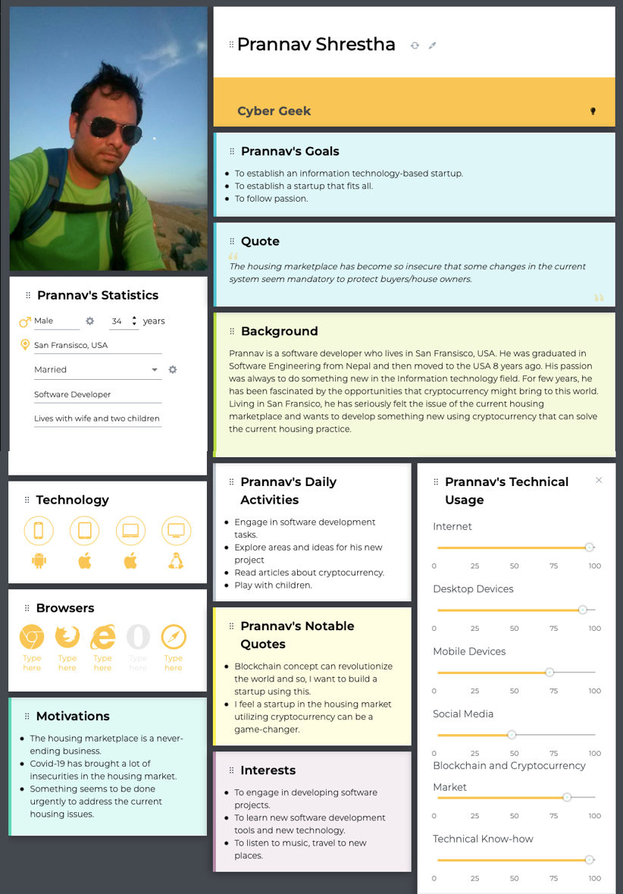

<b>Fig: User Persona for “Administrator”</b>

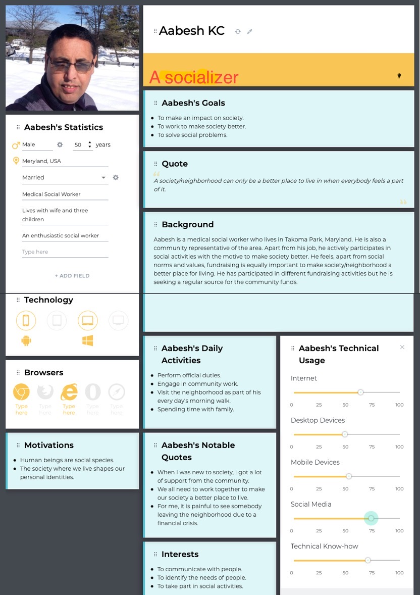

<b>Fig: User Persona for “Community Representative”</b>

## 2. Use Cases, User Scenarios & Requirements
### INTRODUCTION AND MOTIVATION:
We are in the phase of developing a minimalistic **‘Home Equity (HEQ) Coin’**. The HEQ coin is directly connected to the price of a house in a neighbourhood i.e., if there is increase in the housing price, or the buyers are ready to invest more in the house, then **tentatively, the price of HEQ coin may rise**. Similarly, if the house seller is in immediate need of money, and sells the house in price lower than the current price, then **the value of the house will decrease, and correspondingly the value of HEQ coin will decrease**. Therefore, there is a significant need to predict the housing price, as per the past data, which will help the house seller/buyer to sell/buy the house in **right time, and in right price**. In this context, the **use of regression models** will be the best fit in our scenario.
In short, we train our regression model on the historical data of houses, and use the model to predict the housing price using the new data entered by user. And if the error in prediction is more than the acceptable range, then we will update the model to incorporate the error. This is similar to the working of **Zestimate** in Zillow. In our case, the dataset is **provided by Zillow** which provides plenty of historical information about the housing prices and their features. The data can be categorized as “Interior Housing Data” and “Exterior Housing Data” as follows:

<!---->
#### Interior Housing Data:
* Total Rooms
* Total Bedrooms
* Total Bathroom
* Heating
* Air-Conditioning (AC) 
* Fireplace
* Water
* Sewer

<b>Fig: Interior Housing Data</b>

#### Exterior Housing Data:
<!---->
* Condition
* Architectural Style
* Total Stories
* Zoning Descriptions
* Size (acre)
* Size (sq. ft.)
* Topography
* Year Built
* Market Land Value [A]
* Market Improvement Value [B] 
* Market Total Value ([C] = [A] + [B])

<b>Fig: Exterior Housing Data</b>

Furthermore, the price of the house can be predicted using other features like tax records, built year, nearby by schools and universities, nearby markets, granite countertops in kitchen, windows placement, spacious patio, etc.

### USE CASE DIAGRAM
Our system can be broadly divided into two parts i.e., Model Training Phase and Model Inferencing Phase. The use cases in our system are as follows:

<b>Fig: Use Case Diagram</b>

### USER SCENARIOS:
 “**Evangelina** is a 41 years old registered nurse at a hospital in Washington D.C. Though she uses laptop, smartphone and social media frequently, she has not invested on cryptocurrencies yet. She needs to sell her house immediately and she does not know what is the best price of the house. She is frustrated with the fact of her friend’s family selling their house in low price, which later on was doubled in just few months. She is looking for some platforms which can estimate the price of her house based on the interior and exterior data of her house. This would help her to sell her house at right time for a decent amount of money. Furthermore, she is looking forward to some secure digital payment system which will prevent her from all the banking and administrative hassles.”
 
 “**David**, 55, a wealthy businessman, who is currently thinking to expand his business in Washington D.C. He has a good knowledge of cryptocurrencies and recent trends. He is looking for a new house where he can setup his office. He actually wants to see if the area he is going to live is financially competitive. He does not care about the taxes, but his only goal is to get the housing at a financially competitive neighbourhood, which can align with his business strategies. He is looking for a system where he can estimate the housing price based on the given data, and even predict the increasing or decreasing trend in the future. He is a very busy person, so does not want to go to the banks just for a signature. He is looking for some new housing cryptocurrencies.”
 
 “**Felix**, a 35 years young software developer with high patience and optimism. He is very good at investing in stocks and cryptocurrencies. Recently, the price and the corresponding tax of his house rose by 40%. However, he is optimistic with the volatile nature of housing prices and taxes, and plans not to sell the house. Since he is a software person, he is planning to build a Machine Learning model to analyse the trends and predict the best housing price. Additionally, he is still looking for ways to use the increased amount of his housing price in the form of some cryptocurrencies.”

### REQUIREMENTS TABLES
Since, our system is divided into Training Phase and Inference Phase, we will have two requirements table for two different scenarios. They are as follows:

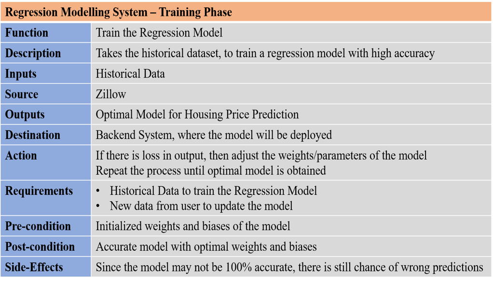

<b>Fig: Requirements Table - Training Phase</b>

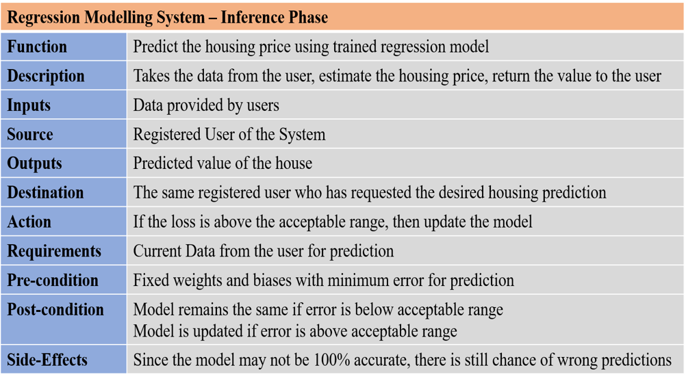

<b>Fig: Requirements Table - Inferences Phase</b>

## 3. Project Management Plan and Charter
The project scope and project charter for the linear regression task will be as follows:

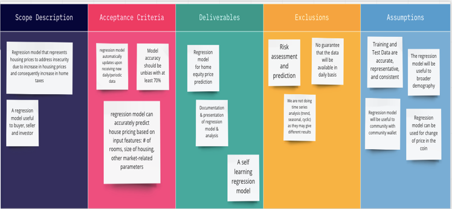

<b>Fig: Project Scope</b>

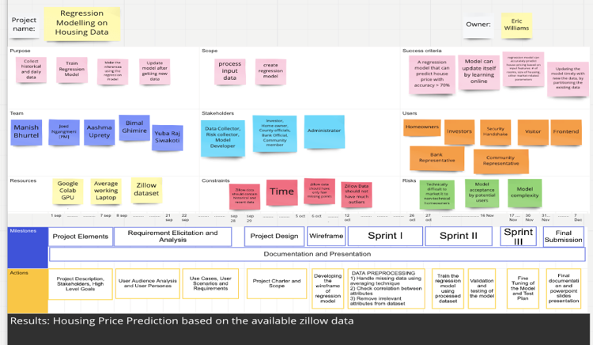

<b>Fig: Project Charter</b>

## 4. High-level Software Architecture Design Diagram

For linear regression task, we combine pipe and filter architecture with blackboard architecture as shown below:

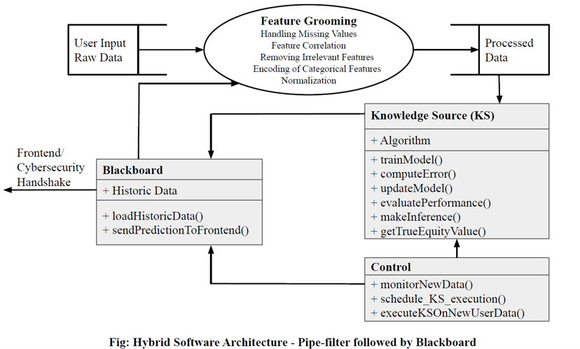

## 5. Wireframes

The high-level working process of linear regression and interaction with other front-end and security handshake module is shown below in wireframe:

<b>Fig: Wireframe</b>

## 6. Data Preprocessing

#### Step 1: Data Filtering and Cleaning

* Removed columns **unit**, **foundation**, **sewer**, **architecturalStyle** because of huge amount of NaN values:
  * *unit*: 260174
  * *foundation*: 239294
  * *sewer*: 115998
  * *architecturalStyle*: 83644
* Removed **zip4**: Since it was found less correlation with the housing price: -0.009316
* Removed **state**: Since we have the data of only the state GA, out model won't get affected with the state. We can add it only if we have the data from multiple states.
* Removed **water**: Since it has only given "Yes" and "NaN" which is unclear.
* Removed **Fireplace**: Since it has only single value "Masonry"
* Removed **Heating**: Since 99% data is labelled as "Forced Air"
* Removed **airConditioning**: Since 99% data is labelled as "Yes"

Since we have only the data for Gwinnett County of GA, the model may be more specific to that county. But we have tried to generalized to other places as well, by introducing the term "Others" for the state, cities, street other than in the Gwinnett County.

#### Step 2 - After Class Update:
* We incorporated "**Architectural Style**", "**Fireplace**", "**Heating**" and "**airConditioning**".
* We added two featues i.e. **soldYear** and **lastPriceSold** which are the simulated data from the actualMarketValue.
* Then we encoded all the categorical features using SKLearn **Label Encoder**, and for the **states** we explicitly encoded the values.
* The label encodings are saved in a **JSON file** which provided the information of the mapping of categorical features with exact index used while data preprocessing.

The features are:
  * **Categorical Features**:
    1.  *City*
    2.  *Street Name*
    3.  *Street Suffix*
    4.  *Land Use Description*
    5.  *Zoning Description*
    6.  *Lot Topography*
    7.  *Condition*
    8.  *State*
    9.  *Heating*
    10. *Fireplace*
    11. *Foundation*
    12. "Air Conditioning

  * **Numerical Features**
    1.  *Zip*
    2.  *Latitude*
    3.  *Longitude*	
    4.  *LotSizeAcres*
    5.  *LotSizeSquareFeet*
    6.  *Year Built*
    7.  *Total Stories*
    8.  *Total Rooms*
    9.  *Bedrooms*
    10. *Baths*
    11. *Built Year*
  
  * **Target**
    1. *housePrice*

#### Step 3 - Outlier Detection and Removal
Outliers are the extreme values that are not representative of the majority of data and normally outside the range of expected values. In machine learning, it's important to understand  the outliers and in most cases need to remove outliers to train the model with representative data. 

There are various approaches to remove outliers such as Z-score, Interquartile Range, DBScan, Isolation Forests etc. In this project we first tried popular approach that is widely applauded by ML communities i.e. Z-Score, also called outlier removal using standard deviation. 

In the Z-score approach, standard deviation can be used as a cut-off point to remove outliers in normal or gaussian like distribution. One standard deviation includes 68% of data, two standard deviations includes 95% of data and three standard deviations  includes 99.7% data points. 
i.e.  if μ is mean and σ is standard deviation then,

* μ  ± σ  ⇒ 68%
* μ ± 2σ  ⇒ 95%
* μ ± 3σ  ⇒ 99.7%
 
In this project, first, we calculated mean and standard deviation for the selected numerical features such as House Price, LotSizeSquareFeet, Total Rooms where we manually observed outliers .Once feature’s mean and standard deviation computed,  we removed outliers with 3 standard deviations, 2.5 standard deviations and 2 standard deviations and trained the model separately. We achieved some improvements in our training and test accuracies by removing outliers, but the improvement is not satisfactory in this method. Then we tried another well accepted outlier removal method, Interquartile Range.

In the Interquartile Range, for each selected numerical feature, we calculated the interquartile range IQR = Q3-Q1. Then we removed data points that is lower than Q1 - 1.5 * IQR and higher than Q3 + 1.5 * IQR as shown in colab screenshot below:

<b>Fig: Interquartile Range Snippet</b>

Once the outliers have been removed from features such as House Price, LotSizeSquareFeet, Total Rooms, we train the model and evaluate both training and test accuracies. In this case, the accuracy scores passed the designed test case and is better than the Z-score method. Therefore, we accepted the Interquartile Range outlier removal method. 

**After data filtering and outlier removal, our regression model has the followings:**
  * *Categorical Features*: 13
  * *Numerical Features*: 11
  * *Target*: 1
  * *Total Data*: 250341

Now, we encode the categorical features into numbers as follows:

#### Step 4 - Encoding Categorical Features

* Converted the data into lower case
* Used **Label Encoding** to assign the number for the street as provided in our dataset (starting from 0)
* Thus, as per our data, the categorical features are in the following inclusive ranges:
  * *City*: [0 - 19]
  * *Street*: [0 - 8152]
  * *Street Suffix*: [0 - 62]
  * *Land Use Description*: [0 - 15]
  * *Zoning escription*: [0 - 84]
  * *Lot Topography*: [0 - 4]
  * *Condition*: [0 - 4]

* The encoded values are stored in an encodings database.

#### Step 5 - Normalization

* For the *categorical features*, we have the minimum and maximum values since we have indexed from (0 - maximum). Therefore, we use the **MinMaxScaling** to scale the categorical data between 0 - 1.

* For the *numerical features*, the values are continuous and we do not have the maximum and minimum values. Therefore, we use the Standard Scaling, which computes the mean and variance based on the standard scaling technique.

* Finally, we dump the scaling models as the pickle files which can be used to scale the values of the features on predictions.

## 7. Testing Multiple Regression Models and Performance Evaluation
We trained different machine learning models (KNN, ANN, Decision Tree and Random Forest) and their performance plots for training and test are shown below. From the evaluation plots, Random Forest outperformed other learning models in both training and test accuracy (R2) score.

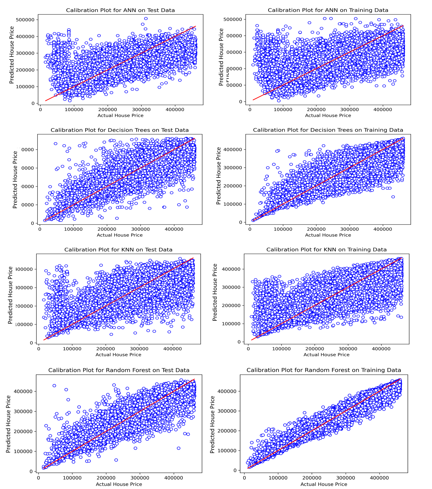

<b>Fig: Multiple Model Performances</b>

<b>Fig: Multiple Model Comparison</b>

## 8. Home Equity Value Prediction
We first used linear regression model to predict housing price and then incorporated amortization table (shown below) to calculate home equity value which is later used by security handshake group to create corresponding equity coins.

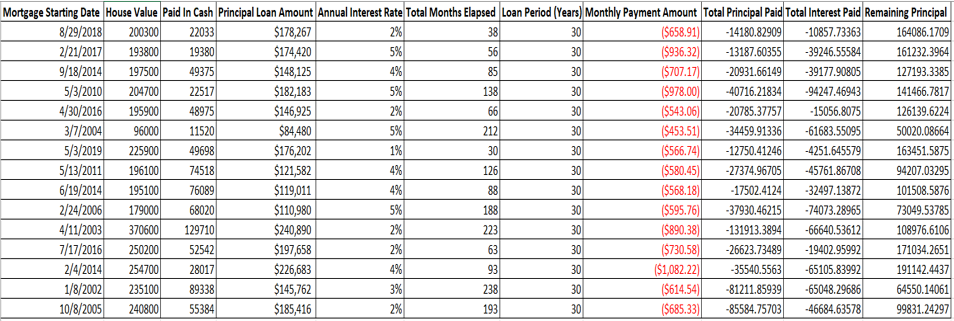

<b>Fig: Amortization Table</b>

    
## 9. HOUSE PRICE AND EQUITY VALUE PREDICTION TEST CASES
The test cases in our regression system are divided in functionality, security and usability test cases. All the test cases are explained in the individual tables below.

### I. Functionality Test Cases:

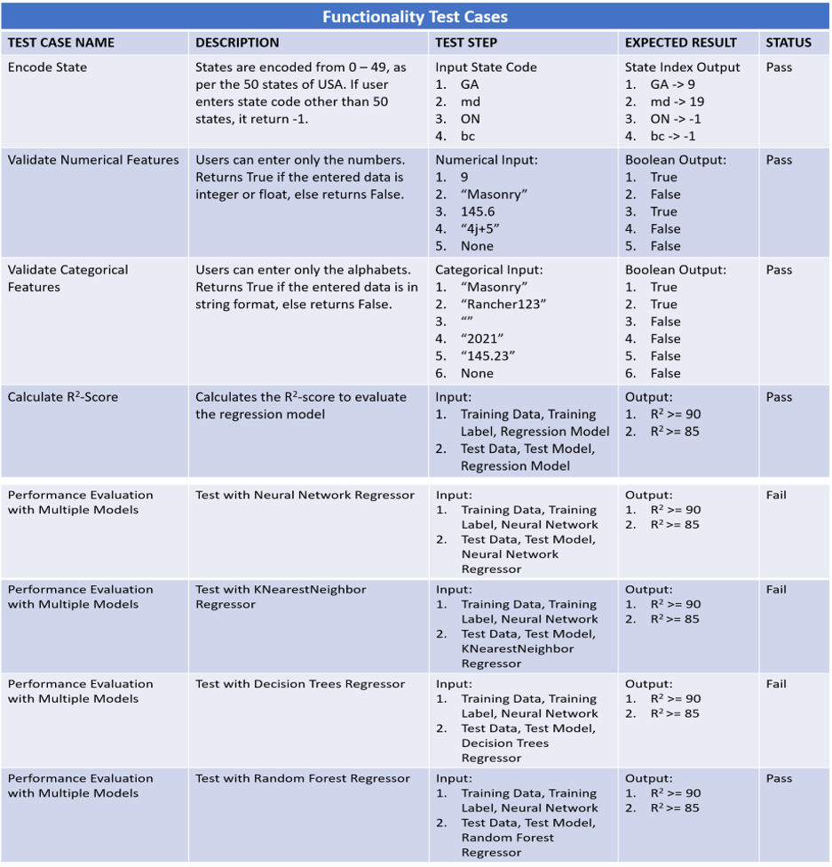

<b>Fig: Functionality Test Case</b>

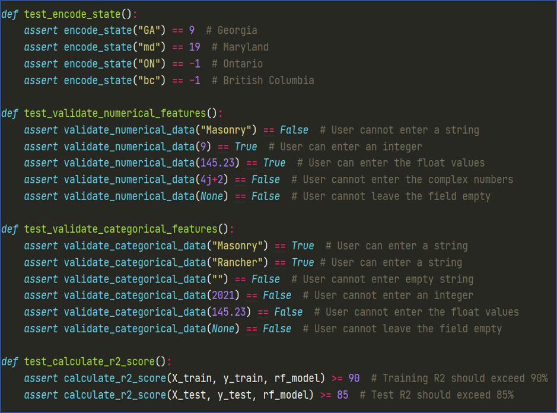

<b>Fig: Functionality Test Case Methods</b>

<b>Fig: Test Case Results</b>

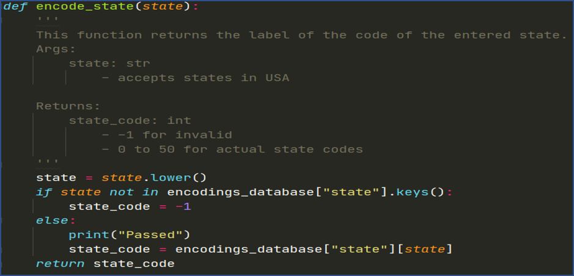

<b>Fig: Method to Handle Encoding of States</b>

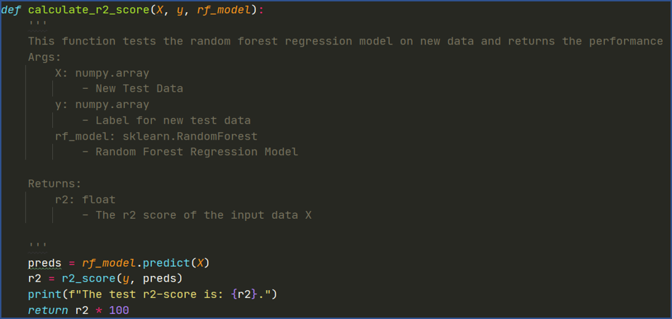

<b>Fig: Method to calculate r2 score</b>

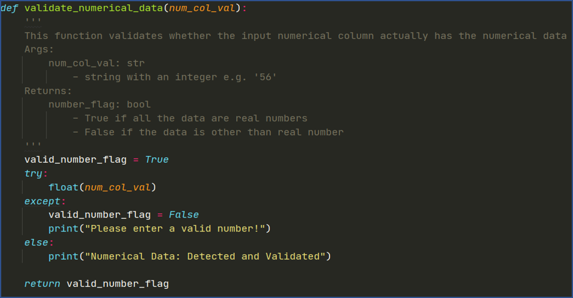

<b>Fig: Method to Validate Numerical Features</b>

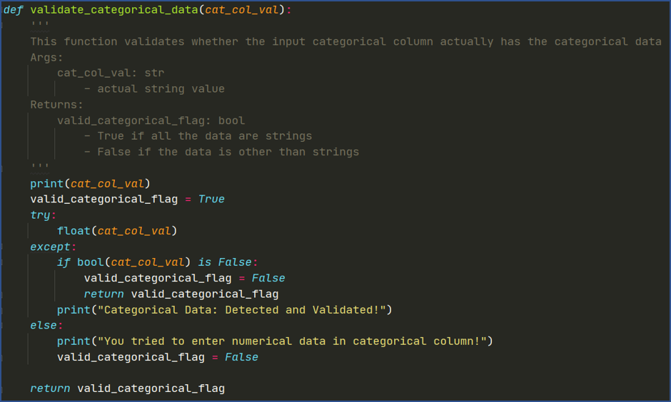

<b>Fig: Method to Validate Categorical Features</b>

### II. Security Test Cases:

<b>Fig: Security Test Cases</b>

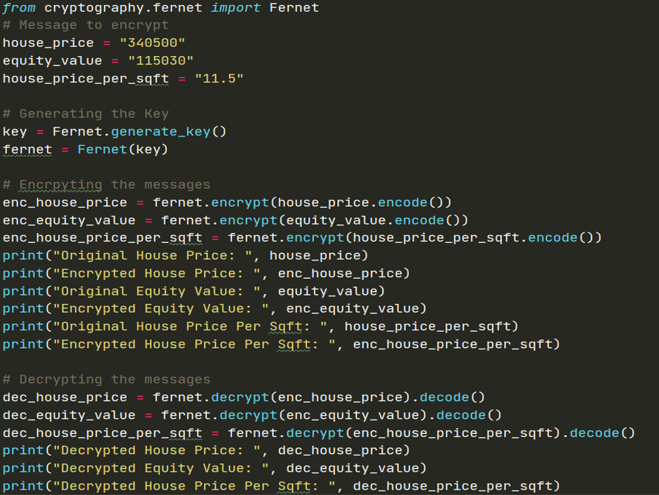

<b>Fig: Fernet Encryption Method</b>

<b>Fig: Results after Encryption</b>

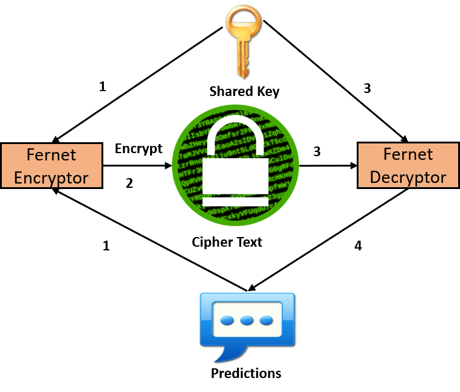

<b>Fig: Fernet Workflow</b>

### III. Usability Test Cases:

<b>Fig: Usability Test Cases</b>

# 10. Online Learning
We used Python-Kafka to simulate the Online Learning Process.
In kafka, there is a producer which accumulates the online data, and stores it in a topic in "utf-8" encoding format. We capture the data from the stored topic, and decode them as the "New Online Data" and "New Online Label".
The following figures shows the workflow of the Online Learning using Kafka.

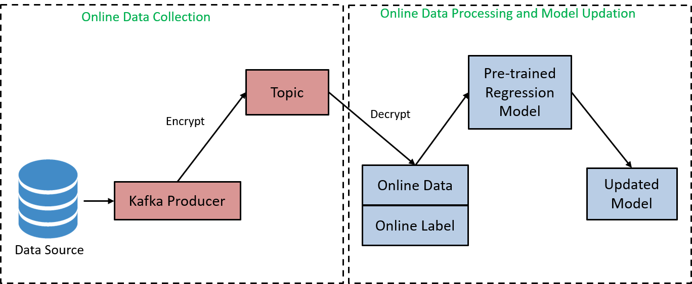

<b>Fig: Online Learning Using Kafka</b>

# 11. Code Obfuscation
We use the Pyarmor which is the python library to obfuscate the python script to the byte codes.
The figures below shows the bytes code for our python script.

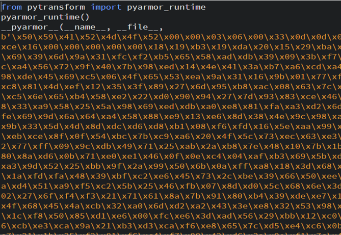

<b>Fig: Code Obfuscation using Pyarmor</b>

